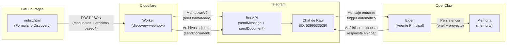
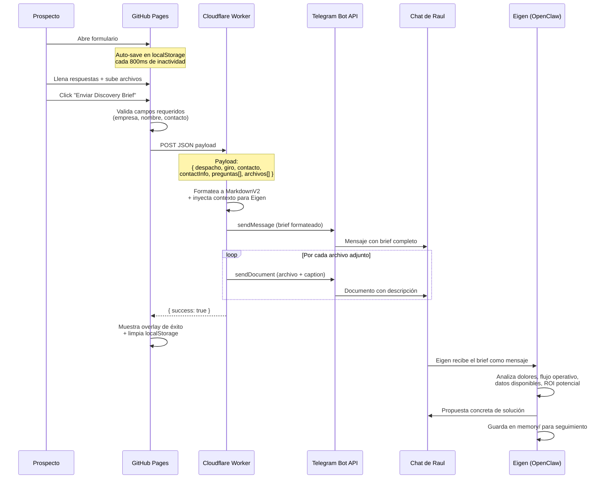

# Eigen Discovery — Formulario de Consultoría de IA

Sistema completo para capturar briefs de prospectos de consultoría de IA, procesarlos automáticamente, y entregar análisis listo para propuesta.

## Arquitectura



## Flujo Completo



## Stack Tecnológico

| Componente | Tecnología | Propósito |
|------------|-----------|-----------|
| **Frontend** | HTML/CSS/JS vanilla | Formulario single-page, zero dependencies (solo Lucide icons + Google Fonts) |
| **Hosting frontend** | GitHub Pages | Deploy automático en push a `gh-pages` branch |
| **Backend** | Cloudflare Worker | Serverless, edge-deployed, formatea y rutea a Telegram |
| **Mensajería** | Telegram Bot API | Entrega de briefs + archivos al chat de Raul |
| **Agente IA** | OpenClaw (Eigen) | Análisis automático del brief, generación de propuesta |
| **Persistencia** | localStorage (cliente) + memory/ (servidor) | Auto-guardado en browser + memoria durable del agente |
| **Fonts** | Inter (sans) + Fraunces (serif) | Tipografía premium via Google Fonts |
| **Íconos** | Lucide | Íconos SVG ligeros via CDN |

## Estructura del Proyecto

```
eigen-discovery/
├── index.html              # Formulario (root, servido por GitHub Pages)
├── frontend/
│   └── index.html          # Copia legacy
├── worker/
│   ├── src/
│   │   └── index.js        # Cloudflare Worker (webhook → Telegram)
│   ├── wrangler.toml       # Config del Worker
│   └── package.json
└── README.md               # Este archivo
```

## Componentes en Detalle

### 1. Frontend (`index.html`)

Formulario single-page con 5 secciones:

1. **Sobre usted** — Empresa, nombre, contacto, giro, decisor
2. **Su operación hoy** — Equipo, volumen, software, flujo de proceso
3. **Lo que más duele** — Top 3 dolores rankeados, horas/costo, errores, estacionalidad, intentos previos
4. **Visión y evidencia** — Prioridad #1 a 30 días, datos digitales disponibles, criterio de éxito
5. **Archivos** — Upload drag & drop, hasta 10 archivos (10MB c/u), con descripción por archivo

**Features:**
- Auto-save en `localStorage` con debounce de 800ms
- Indicador visual "✓ Progreso guardado" (badge verde)
- Datos persisten hasta 30 días o hasta envío exitoso
- Validación de campos requeridos con highlight rojo
- Archivos convertidos a base64 para envío via JSON
- Diseño responsive (mobile-first)
- Cifrado de badge (UX de confianza, no E2E real — es HTTPS)

### 2. Cloudflare Worker (`worker/src/index.js`)

Worker serverless que:

1. Recibe POST JSON del formulario
2. Escapa caracteres para MarkdownV2 de Telegram
3. Formatea el brief con estructura legible
4. **Inyecta prompt de contexto** para que Eigen analice automáticamente
5. Envía mensaje formateado via `sendMessage`
6. Envía cada archivo adjunto via `sendDocument` con caption
7. Responde `{ success: true }` al frontend

**Prompt inyectado:**
> "Estas respuestas son de un prospecto de consultoría de IA. Analiza sus dolores, flujo operativo, errores y datos disponibles. Diseña una propuesta concreta..."

**CORS:** Habilitado para cualquier origen (`*`).

### 3. OpenClaw / Eigen

Cuando el brief llega a Telegram:
1. Eigen lo recibe como mensaje entrante
2. El prompt inyectado por el Worker le da contexto de qué hacer
3. Analiza la información del prospecto
4. Genera propuesta concreta de solución (agente IA, automatización, herramientas)
5. Persiste en `memory/` para seguimiento del proyecto

## Deploy

### Frontend (GitHub Pages)

```bash
cd /tmp/eigen-discovery
git add -A && git commit -m "update" && git push origin gh-pages
```

URL: `https://theovia.github.io/eigen-discovery/`

### Worker (Cloudflare)

```bash
cd worker
npx wrangler deploy
```

Para configurar el token del bot (primera vez):
```bash
echo "<BOT_TOKEN>" | npx wrangler secret put TELEGRAM_BOT_TOKEN
```

URL: `https://discovery-webhook.raul-chio-leon.workers.dev`

## Variables de Entorno

| Variable | Ubicación | Descripción |
|----------|-----------|-------------|
| `TELEGRAM_BOT_TOKEN` | Cloudflare Worker (secret) | Token del bot de Telegram |
| `TELEGRAM_CHAT_ID` | Hardcoded en worker (`5399533539`) | Chat ID de Raul |
| `CLOUDFLARE_API_TOKEN` | Local/CI | Para `wrangler deploy` |

## Seguridad

- **Transporte:** HTTPS en todos los tramos (GitHub Pages → Worker → Telegram API)
- **Archivos:** Convertidos a base64 en el cliente, transmitidos via JSON, nunca almacenados en disco del Worker (serverless, stateless)
- **CORS:** Abierto (`*`) — el Worker no tiene datos sensibles, solo rutea
- **Secrets:** Token de Telegram almacenado como Cloudflare Worker Secret (encriptado at rest)
- **localStorage:** Datos del formulario persisten en el browser del prospecto hasta 30 días — se borran al enviar exitosamente

## Personalización

### Agregar formularios para otros clientes

1. Copiar `index.html` a `nuevo-cliente.html`
2. Editar preguntas, títulos, branding
3. Actualizar el array `PREGUNTAS` en el `<script>`
4. Push — GitHub Pages sirve automáticamente

El Worker es genérico: acepta cualquier JSON con la estructura `{despacho, contacto, contactInfo, preguntas[], archivos[]}`.
